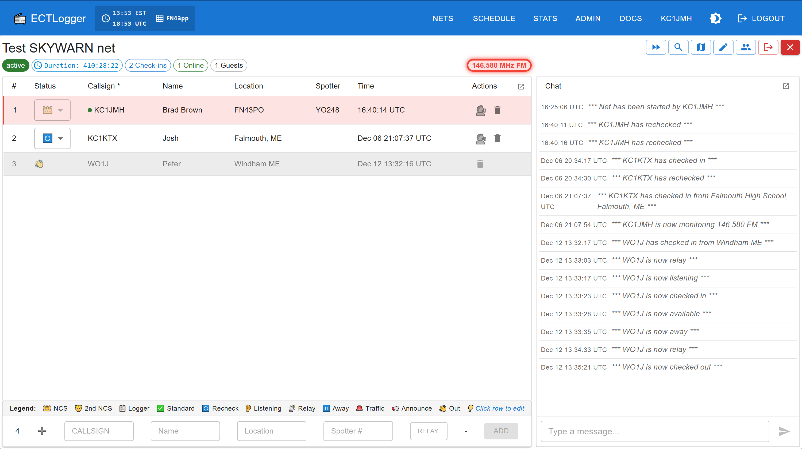

# ECTLogger

## A Modern Radio Net Logger

Whether you're running a casual weekly club net or coordinating a multi-agency emergency response, ECTLogger adapts to your needs. Start simple and grow into advanced features as your operations demand.

**For community nets**, keep things fun and engaging. Add a Topic of the Week to spark conversation, run polls to gather opinions, and let participants chat in real-time alongside the check-in log. The clean, modern interface makes logging effortless—no more wrestling with clunky desktop apps or decade-old web interfaces.

**For SKYWARN and weather nets**, capture what matters. Enable spotter number and weather observation fields to collect critical data from trained spotters. View check-in locations on an interactive map supporting entry of town and state, GPS coordinates, Maidenhead grid squares, UTM, and MGRS formats in the check-in's Location field — perfect for situational awareness during severe weather events.

**For ARES and emergency communications**, ECTLogger handles the complexity. Multiple NCS operators can work different frequencies simultaneously, with check-ins intelligently separated by band but logged together in one unified view. When the incident wraps up, generate ICS-309 Communications Logs with a single click for your after-action reports.

The responsive interface works beautifully on any device — from a phone in the field to a multi-monitor EOC workstation. Pop out the check-in list or chat into detachable windows within the browser to customize your workspace. Dark mode keeps things easy on the eyes during those long operational periods.

**🌐 Try it now at [app.ectlogger.us](https://app.ectlogger.us)** — No installation required!

*Multi-frequency/band check-ins, shown in dark and light mode!* — [📷 More screenshots](assets/screenshots/README.md)

---

## ✨ Features

### Core Capabilities

- **🔐 Secure Authentication** — Frictionless sign-in with magic link email authentication + OAuth (Google, Microsoft, GitHub)
- **⚡ Real-Time Updates** — WebSocket-powered live check-ins, status updates, and chat messages
- **👥 Role-Based Access** — Admin, NCS, Logger, User, and Guest roles
- **📧 Email Notifications** — Automatic net reminders, start notifications, and invitations
- **📱 Mobile Responsive** — Works seamlessly on phones, tablets, and desktops
- **📻 Multi-Frequency Support** — Track stations across multiple frequencies and modes
- **👥 Multi-NCS Support** - Multiple NCS operators can check in and track stations across multiple frequencies and modes simultaneously

### Net Management

- **📅 Scheduling** — Schedule recurring nets with automatic NCS rotation
- **✏️ Inline Editing** — NCS/Loggers can click any check-in row to edit fields directly
- **🔄 Recheck Tracking** — Track stations as they check in and out, on different frequencies if needed
- **📊 Custom Fields** — Admins can create custom fields for specific net requirements
- **📊 Poll Questions** — Add poll questions to nets with real-time results chart
- **💬 Topic of the Week** — Prompt participants to share on a topic during check-in and track their answers
- **🔍 Filter & Sort** — Search and sort nets, schedules, frequencies, users, and fields
- **📋 Card/List Views** — Toggle between card and list views on Dashboard and Scheduler
- **📝 Complete Net Logs** — Automatic log generation and email delivery

### Location & Mapping

- **🗺️ Station Mapping** — View check-in locations on OpenStreetMap
- **🌐 Multiple Formats** — Town & state, GPS, Maidenhead, UTM, MGRS coordinate support in Location check-in field
- **📍 Location Awareness** — Auto-fill Maidenhead grid square from browser location, if enabled by the end user

### Multi-Frequency Net Support

ECT and SKYWARN nets often move between frequencies to meet participants where they are. ECTLogger tracks:

- **Multiple frequencies per net** - Nets can support multiple active channels, frequencies, and modes
- **Active frequency indication** - Users can see which frequency each NCS is active on so that they may follow
- **Per-station frequency tracking** - Each station can check or re-check into more than one operating frequency
- **Real-time frequency change notifications** - Freqency changes are updated to all users in real-time

### Analytics & Reporting

- **📧 Emailed net closure reports** - Net participants can receive chat logs, check-in logs, topic answers, and poll results
- **📃 ICS-309 Communications Log** - For ARES and ECT nets, ICS-309 documents can be downloaded and emailed from closed nets
- **📈 Statistics & Analytics** — Track participation trends, operator activity, and net performance with interactive charts

---

## 👥 User Roles

ECTLogger has two types of roles: **global roles** (system-wide) and **net roles** (per-net assignments).

### Global Roles

ECTLogger provides the following types of users:

| Role          | Description                                                                 |
| --------------- | ----------------------------------------------------------------------------- |
| 🛡️**Admin** | Full system access, user management, view all nets, configure custom fields |
| 👤**User**    | Create nets, check into nets, receive notifications                         |
| 👁️**Guest** | View-only access to public nets (no account required)                       |

### Net Roles

When a user creates a net, they automatically become its **NCS (Net Control Station)**. The net creator can assign these roles to other users:

| Role         | Description                                                   |
| -------------- | --------------------------------------------------------------- |
| 👑**NCS**    | Full control: start/close net, manage check-ins, assign roles |
| 📋**Logger** | Log check-ins and manage station status                       |
| 📡**Relay**  | Check in stations on behalf of others                         |

Any registered user can run their own nets!

### Station Status Tracking

Visual indicators for station status:

- ✅ Checked In
- 👂 Just Listening
- 📻 Available
- ⏸️ Away
- 👋 Checked Out
- 🔄 Recheck (returning stations)

A legend at the base of the check-in list identifies each status icon.

---

## 📋 Net Workflow

### 1. Create Net

Define your net with name, description, frequencies, and required fields. Assign roles and save as draft.

### 2. Schedule (Optional)

Set date/time, configure recurring schedule, and set up NCS rotation with automatic reminders.

### 3. Start Net

NCS starts manually or net auto-starts if scheduled. Email notifications sent to subscribers.

### 4. Log Check-ins

NCS or logger enters check-ins with real-time updates to all connected clients.

### 5. Close Net

Complete log generated automatically and emailed to NCS. Net archived for reports.

---

## 📚 Documentation

### Getting Started

| Document                             | Description                                  |
| -------------------------------------- | ---------------------------------------------- |
| **[User Guide](docs/USER-GUIDE.md)** | How to use ECTLogger as a participant or NCS |

### Self-Hosting

ECTLogger can be self-hosted on your own server. See the self-hosting documentation:

| Document                                                   | Description                                       |
| ------------------------------------------------------------ | --------------------------------------------------- |
| **[Self-Hosting Guide](docs/SELF-HOSTING.md)**             | Overview of self-hosting options and requirements |
| **[Quick Start](docs/QUICKSTART.md)**                      | Get up and running in 5 minutes                   |
| **[Manual Installation](docs/MANUAL-INSTALLATION.md)**     | Step-by-step installation for advanced users      |
| **[Production Deployment](docs/PRODUCTION-DEPLOYMENT.md)** | Deploy with SSL/HTTPS and reverse proxy           |

### Configuration

| Document                                                         | Description                           |
| ------------------------------------------------------------------ | --------------------------------------- |
| **[Magic Link Configuration](docs/MAGIC-LINK-CONFIGURATION.md)** | Configure magic link expiration       |
| **[Email Deliverability](docs/EMAIL-DELIVERABILITY.md)**         | Email setup and troubleshooting       |
| **[Logging](docs/LOGGING.md)**                                   | Configure log levels and debug output |

### Security

| Document                         | Description                          |
| ---------------------------------- | -------------------------------------- |
| **[Security](docs/SECURITY.md)** | Security features and best practices |
| **[Fail2Ban](docs/FAIL2BAN.md)** | Automatic IP banning setup           |

### Development

| Document                                     | Description                         |
| ---------------------------------------------- | ------------------------------------- |
| **[Development Guide](docs/DEVELOPMENT.md)** | Architecture, API, and contributing |

---

## 📄 License

This project is licensed under the **MIT License** — see the [LICENSE](LICENSE) file for details.

You can: ✅ Use commercially · ✅ Modify · ✅ Distribute · ✅ Use privately

With the requirement to include copyright notice and attribution.

---

## 🙏 Acknowledgments

Built for the amateur radio and emergency communications community.

Special thanks to all NCS operators, loggers, and participants who make emergency communication nets possible.

---

## 📞 Support

- **Issues**: [GitHub Issues](https://github.com/bradbrownjr/ectlogger/issues)
- **Documentation**: See links above
- **Questions**: Open a discussion on GitHub

---

**73 and stay safe!** 📻
