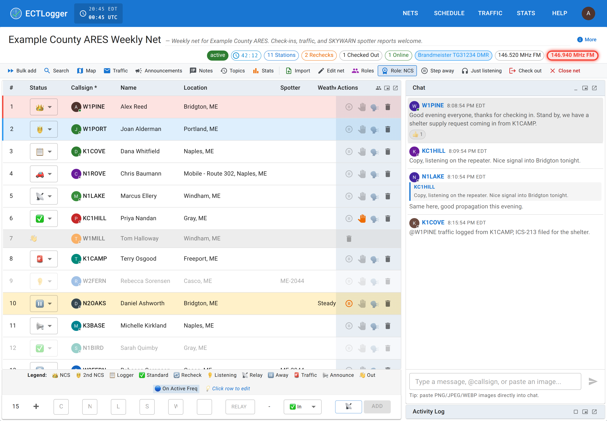

# ECTLogger

[](https://opensource.org/licenses/MIT)

A real-time net logger for amateur radio, built for emergency communications teams, SKYWARN spotter nets, and the clubs that run a weekly check-in. Net Control works the list, everyone else watches it fill in live, and the log is finished the moment the net is.

**Hosted, free, and open to anyone with a callsign: [app.ectlogger.us](https://app.ectlogger.us)**

**Documentation: [ectlogger.us](https://ectlogger.us)**



---

## What it does

- Live check-in logging over WebSockets, with every connected browser updating as it happens
- Several frequencies, modes, and talkgroups on one net, worked by several net controls at once
- Stations with no account and no internet still get logged, mapped, and counted
- Locations in town-and-state, GPS, Maidenhead, UTM, or MGRS, all on one map
- Recurring schedules that create their own nets, remind their staff, and rotate Net Control
- Formal traffic: ARRL radiograms, ICS-213, and RRI weather strips, with a full chain of custody
- Complete logs, ICS-309 Communications Logs, and multi-page PDF reports, generated on close
- Statistics and leaderboards per operator and per schedule

The full feature list, and what each of those actually means in practice, is on the [documentation site](https://ectlogger.us/docs/).

---

## Documentation

Everything for operators, net control, net managers, administrators, and self-hosters lives at **[ectlogger.us](https://ectlogger.us)**.

| | |
|---|---|
| [Check into your first net](https://ectlogger.us/docs/start/first-check-in/) | Five minutes, assumes nothing |
| [Run your first net](https://ectlogger.us/docs/start/run-your-first-net/) | Create it, log it, close it |
| [Self-hosting](https://ectlogger.us/docs/self-hosting/) | Install, deploy, email, logging, hardening |
| [Reference](https://ectlogger.us/docs/reference/) | Statuses, permissions, fields, formats |
| [Changelog](docs/CHANGELOG.md) · [Roadmap](docs/ROADMAP.md) · [Privacy](docs/PRIVACY.md) | |

---

## Running it yourself

ECTLogger is a **Python 3.11+ FastAPI** backend and a **React + TypeScript + Vite** frontend, with SQLite by default and PostgreSQL or MySQL supported. It runs comfortably on a small Linux server.

```bash
git clone https://github.com/bradbrownjr/ectlogger.git
cd ectlogger
cp .env.example backend/.env    # set SECRET_KEY and your SMTP settings
./start.sh                      # or .\start.ps1 on Windows
```

Frontend on :3000, backend on :8000, API docs at :8000/docs.

That is enough to look at it. For anything other people depend on, read [production deployment](https://ectlogger.us/docs/PRODUCTION-DEPLOYMENT/) first, and budget real time for [email deliverability](https://ectlogger.us/docs/EMAIL-DELIVERABILITY/) — the normal way to log in is a magic link in an email, so mail that lands in a junk folder is a login outage.

---

## Contributing

Issues and pull requests are welcome at [github.com/bradbrownjr/ectlogger](https://github.com/bradbrownjr/ectlogger).

Before writing code, read [`docs/DEVELOPMENT.md`](docs/DEVELOPMENT.md) for the architecture and the patterns this codebase already uses, and [`docs/DESIGN.md`](docs/DESIGN.md) for the UI rules, which are stricter than they look and exist because inconsistent controls are genuinely dangerous during an activation.

A change that alters user-facing behavior is not finished until the pages for its audience paths are updated. Which paths a change touches is decided when the roadmap item is written, not afterward.

---

## License

MIT. See [LICENSE](LICENSE).

---

Built for the amateur radio and emergency communications community, and for the net control operators, loggers, and participants who keep these nets on the air.

73 and stay safe.
