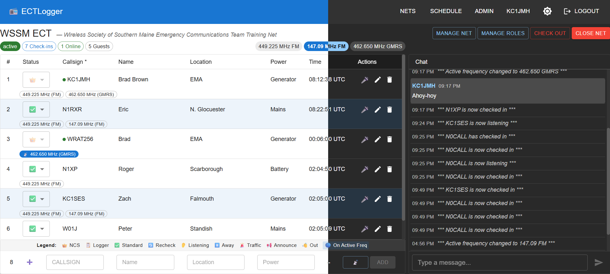

# ECTLogger

## A Modern Radio Net Logger

Whether you're running a casual weekly club net or coordinating a multi-agency emergency response, ECTLogger adapts to your needs. Start simple and grow into advanced features as your operations demand.

**For community nets**, keep things fun and engaging. Add a Topic of the Week to spark conversation, run polls to gather opinions, and let participants chat in real-time alongside the check-in log. The clean, modern interface makes logging effortless—no more wrestling with clunky desktop apps or decade-old web interfaces.

**For SKYWARN and weather nets**, capture what matters. Enable spotter number and weather observation fields to collect critical data from trained spotters. View check-in locations on an interactive map supporting entry of town and state, GPS coordinates, Maidenhead grid squares, UTM, and MGRS formats in the check-in's Location field — perfect for situational awareness during severe weather events.

**For ARES and emergency communications**, ECTLogger handles the complexity. Multiple NCS operators can work different frequencies simultaneously, with check-ins intelligently separated by band but logged together in one unified view. When the incident wraps up, generate ICS-309 Communications Logs with a single click for your after-action reports.

The responsive interface works beautifully on any device — from a phone in the field to a multi-monitor EOC workstation. Pop out the check-in list, chat, or activity log into detachable panels within the browser, or send any of them to their own separate browser window and dedicate a full screen to each for a true multi-monitor NCS setup. On an ultrawide monitor, the script, announcements, and check-in map can dock right into the page layout instead, with resizable panels and columns that remember the size you set. Dark mode keeps things easy on the eyes during those long operational periods.

**🌐 Try it now at [app.ectlogger.us](https://app.ectlogger.us)** — No installation required!

*Multi-frequency/band check-ins, shown in dark and light mode!* — [📷 More screenshots](assets/screenshots/README.md)

---

## ✨ Features

### Core Capabilities

- **🔐 Secure Authentication** — Frictionless sign-in with magic link email authentication + OAuth (Google, Microsoft, GitHub)
- **⚡ Real-Time Updates** — WebSocket-powered live check-ins, status updates, and chat messages
- **👥 Role-Based Access** — Admin, NCS, Logger, User, and Guest roles
- **📧 Email Notifications** — Automatic net reminders, start notifications, and invitations
- **📱 Mobile Responsive** — Works seamlessly on phones, tablets, and desktops, with labeled controls and generous touch targets sized for gloved or one-handed field use
- **🎨 Color Themes & Branding** — Pick a personal color theme (or follow the admin-set system default), each with a coordinated light/dark pair that works with the existing dark mode toggle; admins can fully customize a self-hosted instance with a custom color theme and logo
- **📻 Multi-Frequency Support** — Track stations across multiple frequencies and modes
- **👥 Multi-NCS Support** - Multiple NCS operators can check in and track stations across multiple frequencies and modes simultaneously
- **⏸️ Paused-Net Indicator** — If the NCS steps away with no co-NCS covering, the net shows a blue border and banner so everyone knows no one is actively running it, and the recorded duration excludes that time
- **🔄 New-Version Notice** — A tab left open across a deploy shows a banner offering to reload once a new version has shipped, so you're never troubleshooting on outdated code without knowing it
- **🩺 Diagnostics & Feedback** — The Help menu's Diagnostics tool summarizes your browser, window, and recent errors for a support request; the Submit Feedback form can include that same snapshot with one checkbox and a screenshot you attach, so bug reports arrive with the context needed to track them down

### Net Management

- **📅 Scheduling** — Schedule recurring nets with automatic NCS rotation
- **🚪 Automatic Lobby** — Optionally open a scheduled net's lobby a set number of minutes early so stations can check in before Net Control arrives
- **📜 Net Scripts** — Create formatted scripts for NCS operators to follow during nets
- **🗒️ Net Notes** — Jot down something specific to one net (e.g. a repeater running weak) separately from your schedule's standing announcements
- **✏️ Inline Editing** — NCS/Loggers can click any check-in row to edit fields directly
- **🦔 Speed Entry** - Hit the ⏩ button to enter a string of check-ins in fast-moving nets
- **🔄 Recheck Tracking** — Track stations as they check in and out, on different frequencies if needed
- **🚫 Self Check-In Toggle** — Disable self check-in per schedule or net so only NCS/logging staff add check-ins, for nets where voice roll call and app check-in together cause confusion
- **📊 Custom Fields** — Admins can create custom fields for specific net requirements
- **📊 Poll Questions** — Add poll questions to nets with real-time results chart
- **💬 Topic of the Week** — Prompt participants to share on a topic during check-in and track their answers
- **🔍 Filter & Sort** — Search and sort nets, schedules, frequencies, users, and fields
- **📋 Card/List Views** — Toggle between card and list views on Dashboard and Scheduler
- **📝 Complete Net Logs** — Automatic log generation and email delivery

### Location & Mapping

- **🗺️ Station Mapping** — View check-in locations on OpenStreetMap
- **🌐 Multiple Formats** — Town & state, GPS, Maidenhead, UTM, MGRS coordinate support in Location check-in field
- **📍 Location Awareness** — Auto-fill Maidenhead grid square from browser location, if enabled by the end user
- **📡 Station-to-Station Coverage Logging** — Optional per-net feature letting any station record its own reception, or NCS, Logger, and Relay record on behalf of any station (self-reporting can be turned off to restrict recording to staff), producing a sortable coverage report and a map overlay of confirmed one-way and two-way paths — the coverage-assessment picture ARES and SKYWARN drills need. Includes a personal "stations you can hear from home" map on your Profile, and an optional per-station coverage map in the net's PDF report.

### Multi-Frequency Net Support

ECT and SKYWARN nets often move between frequencies to meet participants where they are. ECTLogger tracks:

- **Multiple frequencies per net** - Nets can support multiple active channels, frequencies, and modes
- **Active frequency indication** - Users can see which frequency each NCS is active on so that they may follow
- **Per-station frequency tracking** - Each station can check or re-check into more than one operating frequency
- **Real-time frequency change notifications** - Freqency changes are updated to all users in real-time

### Assisted Traffic Handling

- **📨 Radiogram & ICS-213 filing** — Fill out an ARRL radiogram or ICS-213 form with live NTS text normalization, word-count checking, and an ARL numbered-message picker, all from the net's Traffic panel or the standalone Traffic section
- **🌦️ RRI weather/RI strips** — File Radio Relay International's WXOBS weather observation strip, the GYX-CAR SKYWARN regional variant, or paste any other RRI strip as a general entry; define your own custom strip type once and it's available to everyone from then on, the same as the built-in types
- **📋 Paste or drop to import** — Paste the plaintext of a message copied off the air, or drag a text file onto the box, and the parser pre-fills a new form for you to review and confirm; anything it doesn't recognize is still saved as a general RRI strip rather than lost
- **✉️ File and track traffic from inside a net** — A Traffic button in the net toolbar opens a panel showing that net's traffic, with its own file/export actions and the same detach, pop-out, and minimize controls as every other net panel; net settings can say which form types a net accepts and pin the WX/RRI strip type (or origin strip) its stations should answer
- **📤 Export a whole net's traffic** — One button in the Traffic panel covers everything filed on that net: plain text (one line per report, ready for a spreadsheet or Winlink template) or a printable PDF with every message laid out like its real paper form
- **📬 Traffic inbox & chain of custody** — Every hop (originated, received, relayed, delivered, serviced, cancelled) is logged against the message, so a net's NCS/logger can see the delivery status of everything logged during their net
- **🖨️ Form-accurate PDF export** — Printable PDFs replicate the real ARRL Radiogram pad and FEMA ICS-213/ICS-309 forms, boxes and rules included, ready to file or hand to the addressee
- **🔒 Privacy by design** — Traffic is visible only to the submitter, current holder, anyone in its chain of custody, that net's NCS/logger, and admins; message bodies never appear on ICS-309 exports, only metadata (message number, precedence, addressee, handling station)

### Analytics & Reporting

- **📧 Emailed net closure reports** - Net participants can receive chat logs, check-in logs, topic answers, poll results, and a traffic-handled summary
- **📥 CSV check-in import** - Closed/archived nets can import CSV logs from paper or external software, with row-level validation and clear errors
- **📃 ICS-309 Communications Log** - For ARES and ECT nets, ICS-309 documents can be downloaded and emailed from closed nets, including traffic-handling metadata rows when the net has that feature enabled
- **📈 Statistics & Analytics** — Track participation trends, operator activity, net performance, and traffic handled (broken out by originated/relayed/delivered/etc.) with interactive charts
- **🏆 Schedule Statistics & Leaderboards** — Per-schedule reporting with time-window filters (30d / 90d / 1y / all-time) and leaderboards for Check-ins, NCS, Logger, and Relay roles, plus a net history log with NCS callsigns
- **📄 Net Report (PDF)** — Generate comprehensive multi-page PDF reports for closed nets including statistics, check-in logs, chat, and ICS-309 sections
- **📄 Schedule Report (PDF)** — Export a schedule's stats, all four leaderboards, and net history as a single printable PDF

---

## 👥 User Roles

ECTLogger has two types of roles: **global roles** (system-wide) and **net roles** (per-net assignments).

### Global Roles

ECTLogger provides the following types of users:

| Role          | Description                                                                 |
| --------------- | ----------------------------------------------------------------------------- |
| 🛡️**Admin** | Full system access, user management, view all nets, configure custom fields |
| 👤**User**    | Create nets, check into nets, receive notifications                         |
| 👁️**Guest** | View-only access to public nets (no account required)                       |

### Net Roles

When a user creates a net, they automatically become its **NCS (Net Control Station)**. The net creator can assign these roles to other users:

| Role                  | Description                                                   |
| ----------------------- | --------------------------------------------------------------- |
| 👑**NCS**             | Full control: start/close net, manage check-ins, assign roles |
| 🤴**Secondary NCS**   | Additional NCS operators for multi-frequency nets             |
| 📋**Logger**          | Log check-ins and manage station status                       |
| 📡**Relay**           | Check in stations on behalf of others                         |

Any registered user can run their own nets!

### Station Status Tracking

Visual indicators for station status:

- ✅ Checked In
- 👂 Just Listening
- 📻 Available
- ⏸️ Away
- 👋 Checked Out
- 🔄 Recheck (returning stations)

A legend at the base of the check-in list identifies each status icon.

---

## 📋 Net Workflow

### 1. Create Net

Define your net with name, description, frequencies, and required fields. Assign roles and save as draft.

### 2. Schedule (Optional)

Set date/time, configure recurring schedule, and set up NCS rotation with automatic reminders.

### 3. Start Net

NCS starts manually or net auto-starts if scheduled. Email notifications sent to subscribers.

### 4. Log Check-ins

NCS or logger enters check-ins with real-time updates to all connected clients.

### 5. Close Net

Complete log generated automatically and emailed to NCS. Net archived for reports.

---

## 📚 Documentation

### Getting Started

| Document                             | Description                                  |
| -------------------------------------- | ---------------------------------------------- |
| **[User Guide](docs/USER-GUIDE.md)** | How to use ECTLogger as a participant or NCS |
| **[Changelog](docs/CHANGELOG.md)**   | What's new in each release                   |
| **[Roadmap](docs/ROADMAP.md)**       | Planned features and what's being worked on  |

### Self-Hosting

ECTLogger can be self-hosted on your own server. See the self-hosting documentation:

| Document                                                   | Description                                       |
| ------------------------------------------------------------ | --------------------------------------------------- |
| **[Self-Hosting Guide](docs/SELF-HOSTING.md)**             | Overview of self-hosting options and requirements |
| **[Quick Start](docs/QUICKSTART.md)**                      | Get up and running in 5 minutes                   |
| **[Manual Installation](docs/MANUAL-INSTALLATION.md)**     | Step-by-step installation for advanced users      |
| **[Production Deployment](docs/PRODUCTION-DEPLOYMENT.md)** | Deploy with SSL/HTTPS and reverse proxy           |

### Configuration

| Document                                                         | Description                           |
| ------------------------------------------------------------------ | --------------------------------------- |
| **[Magic Link Configuration](docs/MAGIC-LINK-CONFIGURATION.md)** | Configure magic link expiration       |
| **[Email Deliverability](docs/EMAIL-DELIVERABILITY.md)**         | Email setup and troubleshooting       |
| **[Logging](docs/LOGGING.md)**                                   | Configure log levels and debug output |

### Security

| Document                         | Description                          |
| ---------------------------------- | -------------------------------------- |
| **[Security](docs/SECURITY.md)** | Security features and best practices |
| **[Fail2Ban](docs/FAIL2BAN.md)** | Automatic IP banning setup           |

### Development

| Document                                     | Description                         |
| ---------------------------------------------- | ------------------------------------- |
| **[Development Guide](docs/DEVELOPMENT.md)** | Architecture, API, and contributing |

---

## 📄 License

This project is licensed under the **MIT License** — see the [LICENSE](LICENSE) file for details.

You can: ✅ Use commercially · ✅ Modify · ✅ Distribute · ✅ Use privately

With the requirement to include copyright notice and attribution.

---

## 🙏 Acknowledgments

Built for the amateur radio and emergency communications community.

Special thanks to all NCS operators, loggers, and participants who make emergency communication nets possible.

---

## 📞 Support

- **Issues**: [GitHub Issues](https://github.com/bradbrownjr/ectlogger/issues)
- **Documentation**: See links above
- **Questions**: Open a discussion on GitHub

---

**73 and stay safe!** 📻
