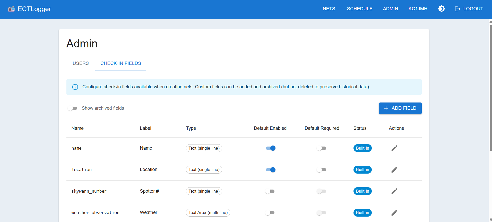

# ECTLogger Screenshots

## Dashboard
*Net overview and quick actions*

---

## Net Management
*Create and manage nets with scheduling*

---

## Custom Fields
*Admins can define custom data fields for specific net requirements*

---

## Check-in Log
*Multi-frequency/band check-ins with dark and light mode support*

---

## Station Map
*View check-in locations on OpenStreetMap - supports GPS, Maidenhead grid squares, UTM, and MGRS coordinates*

---

## NCS Rotation
*Schedule NCS operators with automatic rotation and swap management*

---

*Click any image to view full size*
